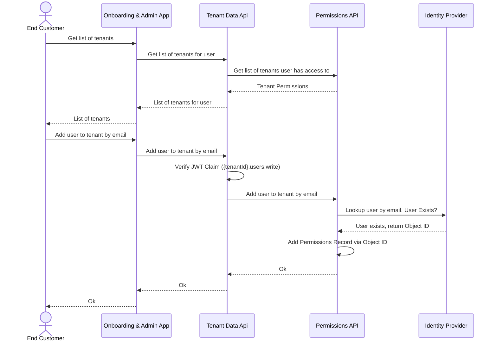

## Add User

### Add New Tenant Admin - Existing User

```mermaid
sequenceDiagram  
actor user as End Customer
participant signup as Onboarding & Admin App
participant admin as Tenant Data Api
participant perm as Permissions API
participant auth as Identity Provider

user->>signup : Get list of tenants
signup->>admin : Get list of tenants for user
admin->>perm : Get list of tenants user has access to
perm-->>admin : Tenant Permissions
admin-->>signup : List of tenants for user
signup-->>user : List of tenants
user->>signup : Add user to tenant by email
signup->>admin : Add user to tenant by email
admin->>admin : Verify JWT Claim ({tenantId}.users.write)
admin->>perm : Add user to tenant by email
perm->>auth : Lookup user by email. User Exists?
auth-->>perm : User exists, return Object ID
perm->>perm : Add Permissions Record via Object ID
perm-->>admin : Ok
admin-->>signup : Ok
signup-->>user : Ok
```

### Overview & Dependencies

### Identity Framework

### User Types

